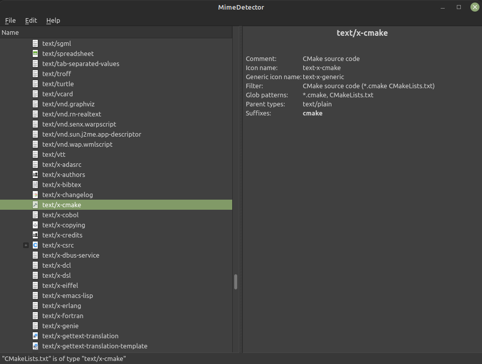

[](https://qt.io)
[](https://www.codefactor.io/repository/github/software-made-easy/markdownedit/overview/main)
[](https://www.gnu.org/licenses/gpl-3.0)
[](https://github.com/software-made-easy/MarkdownEdit/releases/)


# [MimeDetector](https://software-made-easy.github.io/MimeDetector/)

As the name suggests, MimeDetector is a simple program for recognizing the MIME type of files

## Table of contents

1. [Features](#features)
2. [Preview](#preview)
3. [Dependencies](#dependencies)

-------

### Features

- Detect MIME type of files
- Provide details about MIME types



### [Preview](https://software-made-easy.github.io/MimeDetector/mimedetector.html)

A preview is available [here](https://software-made-easy.github.io/MimeDetector/mimedetector.html)

Important:
- Search does not work

## Dependencies:

[Qt](https://qt.io/)

-------

## Build instructions

Run the [build script](scripts/build.sh) or follow the instructions below.

- Clone MarkdownEdit: `git clone https://github.com/software-made-easy/MimeDetector --depth=1 && cd MimeDetector`
- Create the build folder: `mkdir build && cd build`.
- Now create a Makefile with CMake: `cmake ..`.
- Build it: `cmake --build . -j4`

In summary:
```bash
git clone https://github.com/software-made-easy/MimeDetector --depth=1 && cd MimeDetector
mkdir build && cd build
cmake ..
cmake --build . -j4
```
